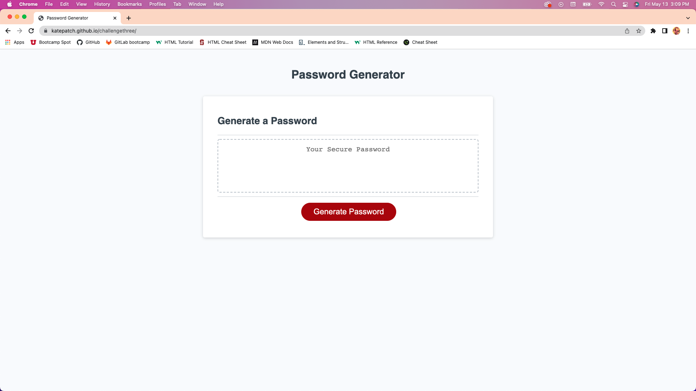

# Password Generator

## User Story

AS AN employee with access to sensitive data 
I WANT to randomly generate a password that meets certain criteria 
SO THAT I can create a strong password that provides greater security

## Acceptance Criteria

GIVEN I need a new, secure password 
WHEN I click the button to generate a password 
THEN I am presented with a series of prompts for password criteria 
WHEN prompted for password criteria 
THEN I select which criteria to include in the password 
WHEN prompted for the length of the password 
THEN I choose a length of at least 8 characters and no more than 128 characters 
WHEN asked for character types to include in the password 
THEN I confirm whether or not to include lowercase, uppercase, numeric, and/or special characters 
WHEN I answer each prompt 
THEN my input should be validated and at least one character type should be selected 
WHEN all prompts are answered 
THEN a password is generated that matches the selected criteria 
WHEN the password is generated 
THEN the password is either displayed in an alert or written to the page

## Notes

started off by creating my strings for possible letter/number/character use for random generation.

Then got into the function of generating the password.  Had a lot of trouble with this part.  Could not seem to get the button to work unless i was refreshing the page and then it would automatically pop up without prompt from button.

So I figured out how the get the function to let me decide what criteria i would like for the password.  Still haven't been able to generate a password.  

This has been an incredibly frustrating assignment!  I have been looking all over to figure this out.  rewatching classes and googling and I am just stumped.

I was able to work with a tutor and she helped me understand the logic a lot better.  I was able to fix it up so now the code has been de-bugged and works great

I know that there are simpler ways to do this but this was the way I got it too work for me with what I know.  Overtime I know I will be able to make this look cleaner and much simpler
